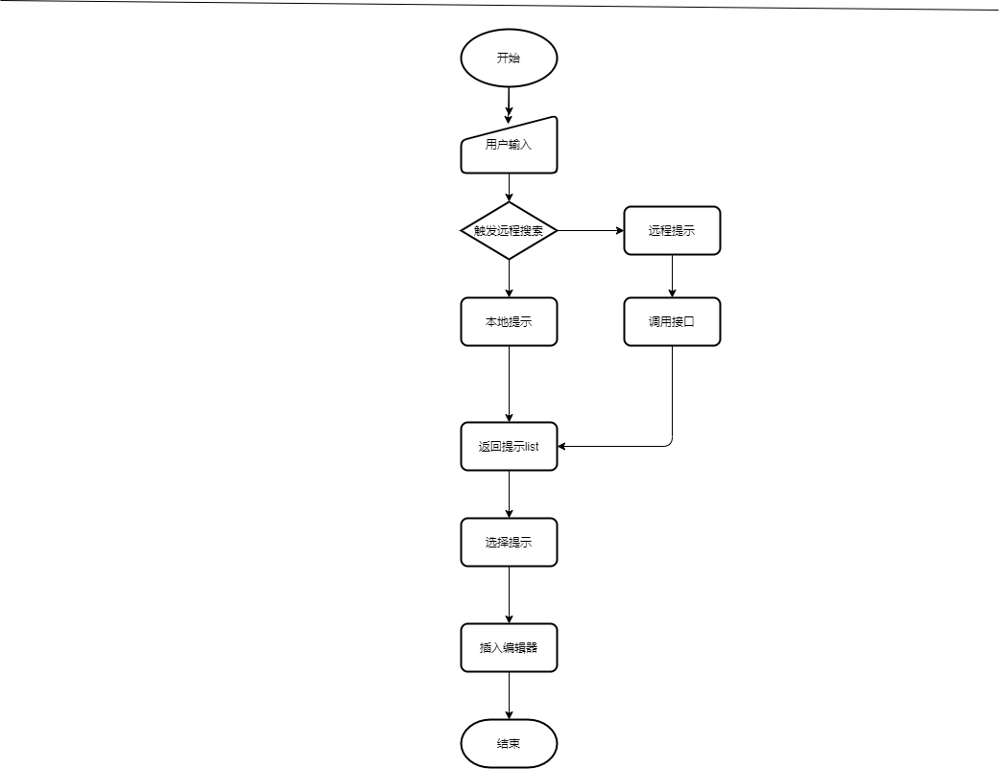

# 前端技术设计文档模板

## 1. 概述

设计实现一个 web 版 代码编辑器，主要功能包含撤销/恢复/代码关键字提示/格式化/diff 对比/编译/ , 智能提示

### 1.1 需求背景&价值

_为什么要做这个需求，价值在哪里，背景是什么_
1、web 代码编辑器进行代码得书写，最终调用后台进行编译测试

2、web 编辑器可以进行撤销/恢复/查找/替换/格式化等操作

项目中用到得地方比较多，设计实现一个通用且满足业务需求得 web 代码编辑器

### 1.2 前置概念

| 英文           | 中文介绍   | Column C |
| -------------- | ---------- | -------- |
| redo           | 撤销       |          |
| undo           | 恢复       |          |
| formatDocument | 格式化文档 |          |
| theme          | 编辑器主题 |          |
| language       | 编程语言   |          |
| IntelliSense   | 智能提示   |          |

## 2. 相关文档

- 需求文档：https://xxxx.com @产品
- 交互文档：https://xxxx.com @交互
- 视觉的稿：https://xxxx.com @UED
- 接口文档: https://xxxx.com @后端

## 3. 总体设计

### 3.1 参考规范

无

### 3.2 流程图

## 4. 内部实现

### 4.1 模块一 智能提示

#### 4.1.1 功能说明

输入语法前缀出现可供选择提示以减少交互，提高效率

#### 4.1.2 流程说明

见上图

#### 4.1.3 模块详细设计

_从技术的角度讲述功能的实现思路。流程、时序方面必须用图示_
